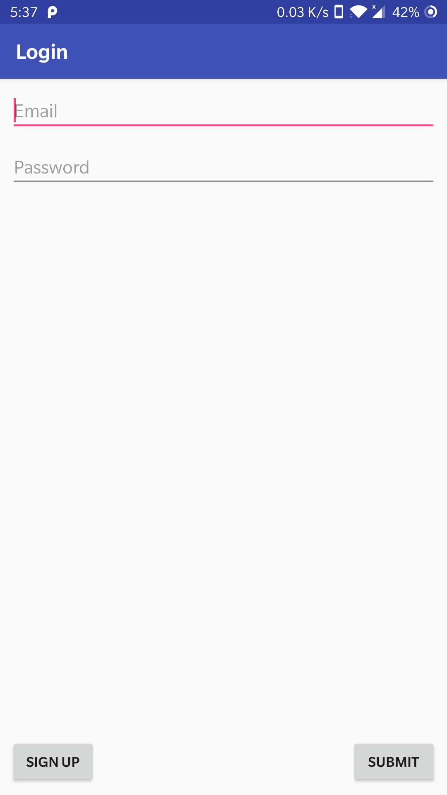
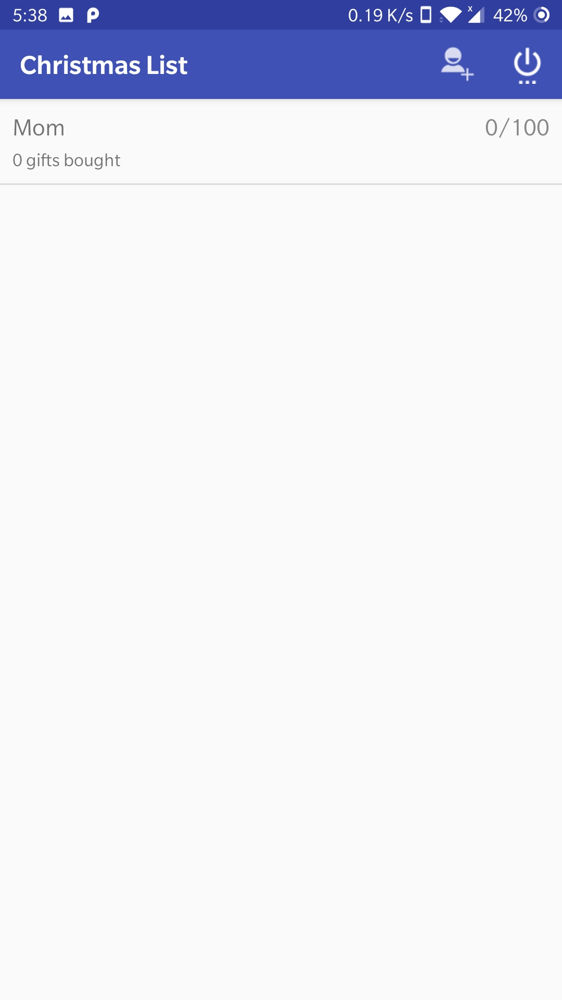
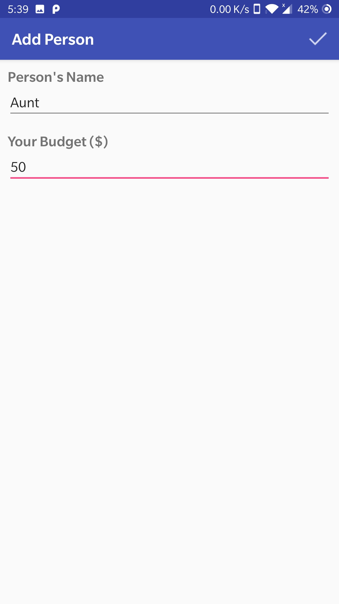
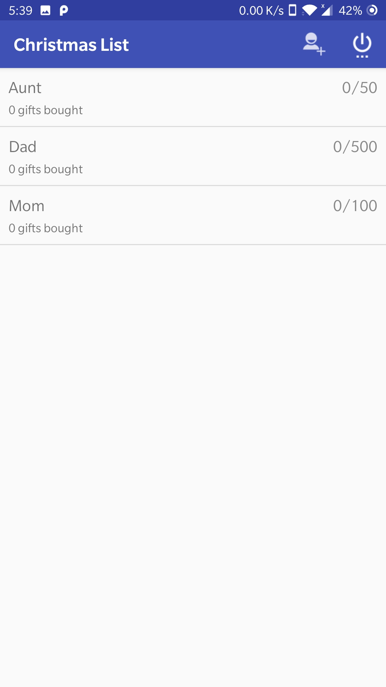
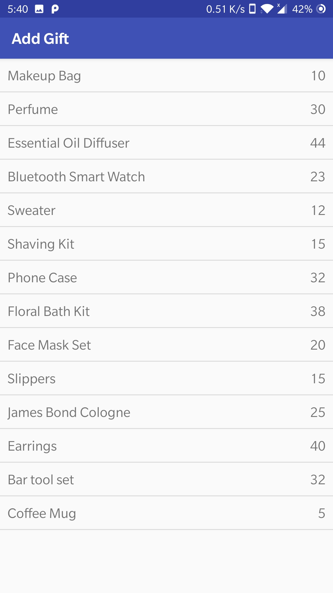
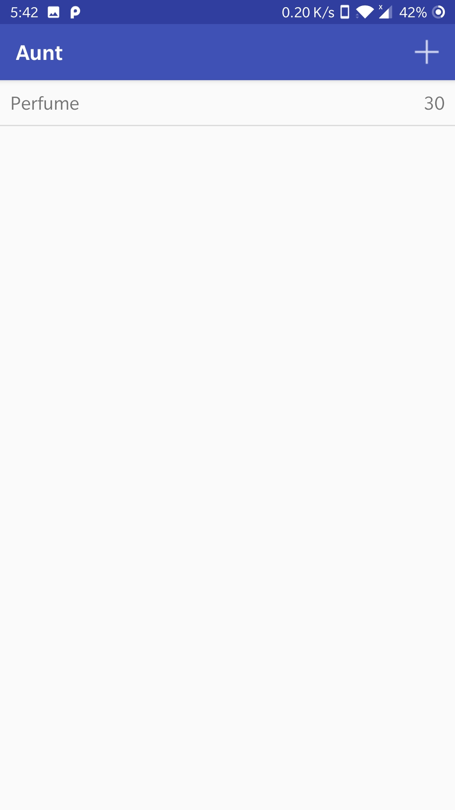
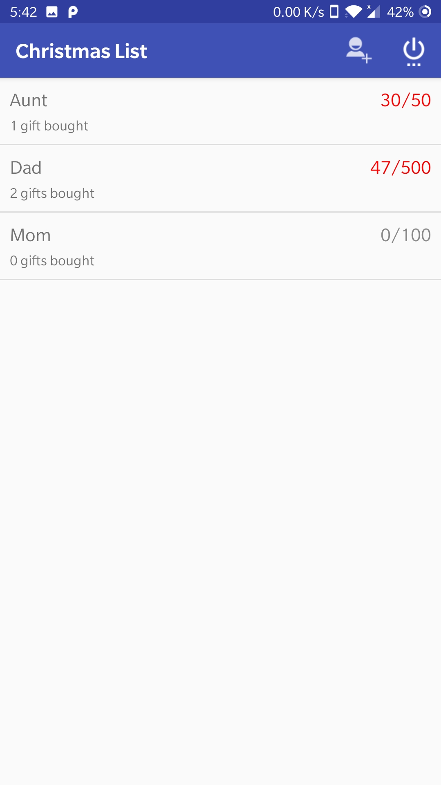

# Christmas-Gift-List-App

The App enables tracking Christmas gift purchasing by quickly entering them into the app. It also enables setting gift budget for each person you plan on buying gifts for.

## Screenshots

Login Screen             |List of people user has added             |Add person screen            |List of people, after adding a person             |
:-------------------------:|:-------------------------:|:-------------------------:|:-------------------------:
  |   |   |  

Add gifts from list             |Gifts added for the selected person             |List of people with change in the amount            |
:-------------------------:|:-------------------------:|:-------------------------:
  |   |  

## Getting Started

These instructions will get you a copy of the project up and running on your local machine for development and testing purposes.

### Prerequisites
* Android Studio [Download Android Studio](https://developer.android.com/studio)

### Installing

1. Clone the repository.
2. Open the project in Android Studio.
3. Install Android Emulator. [Follow steps](https://developer.android.com/studio/run/emulator#install)
4. Run the project on android emulator.
